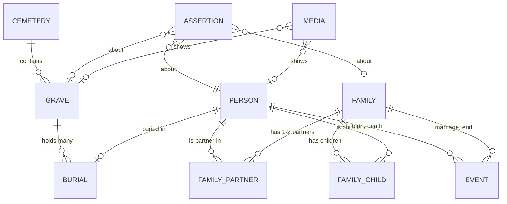

# Grobing — Project Brief

> The synthesis of the kick-off session. Grows live across Phases 1-3. The source of truth for
> what this product is and how it will be built. Downstream agents read this first.

> **Language:** this kick-off brief follows NPG's default (`npg-principles.md` §7) — English artefacts,
> Polish conversation. **For the product's own vault and agents, MD1 decided otherwise:** content in
> Polish, headings and field names in English (resolved 2026-10-05).

> 🔁 **Redacted for publication, 2026-10-05 — the author's decision** (NT-008 points 2-3, before the
> first commit): §2 the source's time window rephrased without an estimate · §3a the reference to the
> author's private registry and an unrelated space removed · §Architecture → *Reuse* a detail of
> another app's signing setup removed. Nothing else changed.

## Profile
status: approved

> 📍 **The profile's home was handed over to `00_START_HERE/kickoff/PROFILE.md` at materialization
> (2026-10-05).** This section **points, it does not duplicate** — the profile outlives the kick-off
> (generated agents read it every session), and two live copies would drift.
>
> **Do not restore the content here.** One-line orientation: solo · experienced (shipped Flutter app) ·
> thin slice · **heavy process** (the relaxed part is the deadline, not the process) · real personal
> product · confirmed at the Phase 0 checkpoint, 2026-10-05.

---

## Discovery (sections 1-6)
status: approved

> 🔁 **Reopened and re-approved 2026-10-05** — back-loop from MD4 (`kickoff-workflow.md` §Pętle wstecz):
> choosing MVP, the user moved **view 5 into the MVP** (option B, over the recommended A). Edited: §5
> Must/Should, §2 "Does the Must set deliver", §3b H4, §4a. Re-approved by the user ("tak"). Nothing
> downstream was `approved`, so no desync.

> **Approved by the user at the Phase 1 checkpoint, 2026-10-05** ("tak" — to the summary, to the value
> sentence as re-read, and to the placement of sufficiency gaps G1-G8).

> Pre-pipeline input (prior-art scan, value hypothesis, data-model traps) lives in
> `SESSION_STATE.md` §Work done before the pipeline. It is **input to these sections, not their
> substitute** — each section below is filled in conversation.

## 1. Problem & Users

- **Problem:** (*declared*, 2026-10-05) the user wants one place that records the family's dead —
  so that in future years it is known **which graves to visit, who is buried in each, and how each
  person connects to the family**. Today this knowledge lives in notes from previous years and in
  the heads of older relatives.
- **Primary user:** the author — **and only the author** (*declared*, 2026-10-05: "only me"; options
  offered were me + spouse / wider family viewing / wider family editing). The app lives on the author's phone;
  nobody else reads or writes.
- **How they solve it today:** **handwritten notes on paper**, kept across previous years
  (*declared*, 2026-10-05). Per cemetery plot they record: **who is buried there, who the person was,
  and their blood / in-law relations** — i.e. the content of views 3 and 4 already exists, on paper.
  **Volume (*declared*, estimate, 2026-10-05): ~50 graves · 10 cemeteries · ~100 people.** At this
  size the tree, the time slider and the relationship path have enough material to earn their place
  (the pre-pipeline threshold was "8 graves in 3 cemeteries → a list is enough; ~60 people in ~15
  cemeteries → tree and path pay off"), and 10 cemeteries make the Poland-level map meaningful.
  It also sizes the transcription: ~100 person records plus their relations, by hand.
  External tools exist for every single view, separately — see `SESSION_STATE.md` §Prior-art scan.
  - **What the notes do NOT carry (inferred from the description — to be checked at transcription):**
    map positions (views 1-2 need them captured on site or pinned from satellite imagery) · photos ·
    dates are unconfirmed — **marriage dates in particular are almost never on a gravestone**, and
    the time slider (view 5) needs them.
  - **Consequences:** (1) the first data the app ever holds comes from **transcribing paper** — that
    is a real piece of work and possibly the first user journey, before any cemetery visit; (2) the
    paper is **a single copy** — a status-quo risk in itself (loss = the knowledge is gone).

## 2. Value & Scope

- **The one thing** — *for whom · what stops hurting · how you will know it works:*
  ✅ **Confirmed by the user, 2026-10-05** (answered "tak" to the sentence and the success signals together).
  > **For me — the one person in the family collecting what we know about our dead, while
  > grandmother can still tell it — Grobing replaces illegible, single-copy paper notes with one
  > private place where every grave leads to the people buried in it and to how they connect to me,
  > and which outlives both me and the app. I will know it works when the paper notes are no longer
  > needed, and every conversation with grandmother ends with new facts in the app.**
  - *For whom:* the author, in a specific situation — the family's sole collector, with a living
    source whose time is limited.
  - *What stops hurting:* before = knowledge split between illegible single-copy paper and
    grandmother's memory, impossible to extend or see. After = one place, extendable, visible, durable.
  - *How you will know:* two observable signals — the paper is no longer consulted; sessions with
    grandmother produce entries, not more paper.
  - **Substitution test (passes, narrowly — the differentiator is named):**
    - *MyHeritage / FamilySearch:* tree, photos, survives the author — but **not private** (a company's
      cloud holding living relatives) and **person-anchored**: a grave is an attribute of a person,
      there is no "stand at this grave → who lies here → how they reach me".
    - *Grobonet / BillionGraves:* grave-anchored and mapped — but **no family relations**, and
      Grobonet only covers cemeteries whose administrators use it.
    - *Gramps:* private, a proper tree, GEDCOM — but **desktop and person-centred**; no grave-first
      navigation on a phone at the cemetery.
    - → **The value lives in the combination: private + grave as the entry point + "how does this
      connect to me".** Drop any one of the three and an existing tool already does it.
  - **Falsification** → §3b H1: *if, sitting with grandmother, I keep writing on paper instead of in
    the app, the value is false* — the product would be a nicer archive, not a better way to capture.
- **Is the user someone other than the author?** **No** (*declared*, 2026-10-05). → the business half
  of the canvas degenerates (Segments = me, Channels = internal, Revenue = none); the value is the
  **cost of the status quo** below. Signal for `npg-architect` MD3a.
  - ⚠️ **Tension to resolve in "What survives" below, not here:** the stated purpose is *"so that in
    the future it is known…"*. If the only user is the author, the knowledge still lives in one
    person — only moved from the author's head to the author's phone. Whether "the future" means **the author's own next
    1 November** or **the family after the author** changes what must outlive the app.
- **If NO — cost of the status quo:**
  - **What this work costs today** (*declared*, 2026-10-05): the paper notes are **hard to read**,
    **hard to update**, **cannot hold photos**, and **cannot show** who is buried where or where the
    families connect.
    - *Shape of the answer, recorded honestly:* these are **limits of the medium**, not incidents —
      no grave that could not be found, no knowledge already lost, no hours named. The "before" state
      is real (illegible, frozen, flat), but its cost is not yet measured.
  - **What happens if it is never built** (*declared*, 2026-10-05): (1) **the notes get lost** — a
    single paper copy; or (2) the paper keeps being used and **nothing gets added**, because there
    is no convenient way to add to it; and (3) — the load-bearing one — **grandmother, the most
    important source, has limited time, and with her goes the chance to fill in what the family
    knows.**
    - **This answer reframes the cost.** The previous answer named limits of the medium; this one
      names a **loss with a closing window**: the most perishable asset is not the notes but **a
      living person's memory**. Grandmother is not a user of the product — she is its **most
      important source**, and the source has an expiry the product cannot move.
    - **Consequence for scope (to be tested at MoSCoW, not decided here):** if the window is the
      pain, then **capturing from grandmother** (sitting with her, adding facts, photographing old
      photos, recording who-is-who) is at least as urgent as visualising what is already known.
- **What survives this product?** **The data — and it must outlive both the author and the app**
  (*declared*, 2026-10-05: option 2, "also the family after me"). Single user, multi-generational
  data. Consequences, read by MD2/MD4 and by the architect's Step 0 (domain canon):
  - readable **without the app** (a human-readable export, not only a database file);
  - ~~export to GEDCOM 7 without loss~~ → **demoted to nice-to-have by the user, 2026-10-05**: *"I am
    not sure I will use GEDCOM — I will rather build my own database from scratch."* The durability
    requirement itself stands (option 2 above); it is now carried by the human-readable export and the
    off-phone copy, not by a standard format.
    - ⚠️ **Flag for `npg-architect` Step 0 (domain canon), not a decision here:** "own database" and
      "GEDCOM" are not alternatives — GEDCOM can be the **canon the own model is checked against**
      (family as a record, several people per grave, uncertain dates, maiden names) without ever
      importing or exporting a file. A model that follows the canon keeps a later GEDCOM export
      cheap; a model that does not makes it a migration. That is the hard-to-reverse part.
  - a copy **off the phone** — a phone-only store is the same single copy as the paper, just newer.
  - This is the *reusable / durable* branch: it **justifies the heavy process** chosen in §Profile —
    the durable artefact is the family record, not a one-off campaign.
  - **Resolves the tension above:** "only me" describes who uses the app; "the family after me"
    describes who inherits the data. Both hold.
- **Success in 3 months / 1 year:** (✅ confirmed with the value sentence, 2026-10-05)
  - **3 months:** all ~100 people and ~50 graves from the paper notes are in the app; the paper is
    no longer consulted; at least one session with grandmother has added facts that were not on paper.
  - **1 year (1 November 2027):** all 10 cemeteries visited using the app instead of the notes;
    a full export is readable without the app, and a copy exists off the phone.
    *(Changed 2026-10-05, same session: the confirmed version said "a GEDCOM export opens in another
    program"; the user then demoted GEDCOM to nice-to-have. The signal follows the durability
    requirement, not the format.)*
- **Re-read at the end of Phase 1** (npg-discover §1.9): **2026-10-05 — unchanged.** Re-read against the
  canvas, hypotheses, journey and MoSCoW, and confirmed by the user at the checkpoint. Neither GEDCOM's
  demotion nor "visit" as the main flow changed who it is for, what stops hurting, or the signals.
- **Does the Must set (§5) deliver the one thing?** ✅ confirmed with §5, 2026-10-05 — **yes:**
  *"every grave leads to the people buried in it"* = **M3 + M4**; *"and to how they connect to me"* =
  **M5**; *"outlives both me and the app"* = **M8**; *"paper notes no longer needed"* = **M1 + M2-M6**;
  *"every conversation with grandmother ends with new facts in the app"* = **M1**. **Not needed for the
  value:** the tree, the slider and the any-two path (view 5) — they make the knowledge *richer to
  look at*, not *possible to keep*. That is why they sit in Should, not because they matter less to
  the user.
  - 🔁 **Updated 2026-10-05 (MD4 back-loop):** view 5 (M9-M11) is now in Must **by the user's
    choice, beyond the value minimum** — the sentence above still holds: view 5 is not what makes
    the knowledge *keepable*. Consequence said out loud: **"MVP done" now depends on spike H4**; using
    views 1-4 does not, because task-level slices are usable as they land.

## 3. Lean Canvas

> **Lean, not BMC** — solo, personal, pre-anything (`discovery-frameworks.md` §Which canvas). Four
> cells degenerate because the author is the only user; they are recorded as such and **replaced** by
> the status-quo cost in §2, not filled with ceremony.

| Cell | Content |
|---|---|
| **Problem (top 3)** | 1) The family's knowledge of its dead sits on illegible, single-copy paper — cannot be extended or seen. 2) The main living source (grandmother) has a closing window. 3) Nothing shows graves, the tree and "me" together. |
| **Existing alternatives** | Paper notes · MyHeritage / FamilySearch (tree) · Grobonet / BillionGraves (graves) · Gramps (private tree, desktop) |
| **Customer segments** | *Degenerate* — the author, sole user. → §2 status-quo cost. |
| **UVP** | Every grave leads to its people and to me — private, and outliving the app. |
| **Solution (top 3)** | 1) **Capture** — grave → people → relations, with photos, fast enough to use at grandmother's table. 2) **Navigate** — Poland map → cemetery → grave. 3) **Understand** — tree, time slider, relationship path. Underneath all three: **durable export** (human-readable + off-phone copy; GEDCOM nice-to-have). |
| **Key metrics** | People transcribed from paper (/~100) · graves with a map position (/~50) · facts added per session with grandmother (>0, every time) · full export readable without the app (pass / fail) |
| **Channels** | *Degenerate* — none. |
| **Revenue** | *Degenerate* — none. |
| **Cost structure** | The author's time: transcribing ~100 people + building. Possible external costs → §6: map / satellite imagery beyond free tiers, off-phone storage. |
| **Unfair advantage** | **Not degenerate here, and load-bearing:** the notes and access to grandmother. The moat is the **source**, not the software — which is also why losing the source is the real risk. |

## 3a. Internal competition (npg-discover §1.4)

The author's other projects checked (2026-10-05). **None solves this problem or a neighbouring
one** — Grobing is not a feature of anything existing.

- **Closest by shape: Friendsheet** — a phone app about people and relationships, **shipped to Google
  Play** (Flutter + Firebase). Different problem (living friends, meeting cadence) — **not a
  competitor, but prior art in the author's own portfolio** for: a shipped mobile stack, a Play Store
  pipeline, a session-closing ritual with manual verification (pattern WZ-024). ⚠️ For `npg-architect`:
  Friendsheet keeps data in a **cloud** service; here the tree holds **living relatives** and the
  value sentence says **private** — reuse of the stack is not automatically reuse of its storage model.

## 3b. Hypotheses (Assumptions Mapping — TEST FIRST quadrant)

> **VPD deciding question asked, 2026-10-05:** *"less certain — can we build it, or will you actually
> swap paper for the app?"* → user: **"can we build it"** (recommendation was the other one).
> **VPD does not run;** the validation budget goes to feasibility first. The falsification hypothesis
> from §2 (H1) stays in TEST FIRST regardless — it is the value's own test, not a VPD artefact.

Colour: 🟢 desirability · 🔵 feasibility · 🟡 viability · 🟣 adaptability.

| # | Hypothesis — *We believe that…* | Importance | Evidence today | Quadrant |
|---|---|---|---|---|
| **H1** 🟢 | …sitting with grandmother, **I enter new facts in the app, not on paper** — ≥80% of new facts from the first 3 sessions land directly in the app. *(falsification of §2)* | high | none — the user sees it as "a matter of filling in" | **TEST FIRST — tested in use, no separate experiment** (user, 2026-10-05); measured by the 3-month success signal |
| **H2** 🟢 | …grandmother knows things the notes do not — the first session yields ≥5 facts absent from paper. | high (if not, the urgency collapses) | belief only | **TEST FIRST — tested in use**, same as H1 |
| **H3** 🔵 | …grave positions can come from **existing cemetery maps** rather than by hand — and where they cannot, a manual pin (satellite imagery or on-site GPS) is close enough to walk to the grave (≥45/50). | high (views 1-2 hinge on it) | partial — see the note under the table | **TEST FIRST** |
| **H4** 🔵 | …a family graph of ~100 people **with in-laws and remarriages** can be laid out **readably on a phone screen**. | high — **blocks "MVP done"** since view 5 moved into Must (2026-10-05) | prior art renders trees, but desktop/web and mostly blood lines | **TEST FIRST** |
| **H5** 🔵 | …the paper notes carry **enough dates** for the time slider — birth, death and marriage dates. | medium-high (view 5) | **declared by the user, 2026-10-05: "I have this information"** | **KNOWN** |
| **H6** 🔵🟣 | …a **GEDCOM 7 export round-trips** with no loss of people, families, burial places, plot addresses and photos. | **low — GEDCOM demoted to nice-to-have** (user, 2026-10-05) | the standard exists; plot-level address has no obvious home in it | **DEFER** — durability now rests on the human-readable export (low risk) |
| H7 🔵 | …the path between two people can be shown **as a chain** ("me → wife → her father → …"). | medium | **strong** — it is a shortest path in a graph, a solved problem; the user's own example is a chain | KNOWN |
| H8 🔵 | …the chain can also be **named in Polish kinship terms** (teść, szwagier, ciotka cioteczna…). | low — the chain already answers the question | none; kinship naming is genuinely hard | DEFER |
| H9 🔵 | …the app works **offline at the cemetery** (weak signal: cached map, local data). | medium | none | DEFER — test on site with H3 |
| H10 🟡 | …free tiers of map / satellite imagery suffice for 10 cemeteries and one user. | low | likely | FILE |
| H11 🟢 | …after transcription the paper is no longer consulted — on 1 Nov 2027 every visit uses the app. | high | none | **critical, not testable now** — annotated, deferred to 1 Nov 2027 |

**TEST FIRST — revised with the user, 2026-10-05.** Two dedicated experiments + one tested in use:

1. **H3 — where grave positions come from:** (a) check which of the 10 cemeteries are covered by
   Grobonet (10 searches); (b) for one uncovered cemetery, pin 3 graves from satellite imagery before
   1 Nov and check on site on 1 Nov. *1 November is the natural test day.*
2. **H4 — tree on a phone:** lay out the real ~100 people (in-laws, remarriages) on a phone-sized
   screen with existing tree-layout approaches; readable or not.
3. **H1 + H2 — tested in use**, not as a separate experiment (user's call: "a matter of filling in").
   Read off the 3-month success signal: did grandmother sessions add facts, and did they land in the
   app or on paper?

Dedicated experiments (1, 2) become **non-code verification items** in the backlog (materializer,
`non-tech-item.template.md`). H1/H2 need no item — the success signal is their measurement.

> **H3 — what existing maps give (web check, 2026-10-05):**
> - **Cemetery location and layout (views 1-2): available without manual work.** Cemeteries are on
>   every base map (OSM `landuse=cemetery`); satellite imagery shows the paths.
> - **Individual graves: only partly.** [Grobonet](https://antyweb.pl/jak-znalezc-zmarlego-na-cmentarzu-grobonet-i-inne-wyszukiwarki-grobow)
>   (operator: Artlook Gallery, "Interaktywny Administrator Cmentarza") has a grave map, photos and
>   "navigate to grave" — **but only for cemeteries whose administrators run its system**, and **no
>   public API was found**. Reuse = **link to the grave's Grobonet page, not copy its data** (copying a
>   commercial database also raises database-rights questions → §6). OSM has a
>   [`cemetery=grave`](https://wiki.openstreetmap.org/wiki/Tag:cemetery%3Dgrave) tag, but individual
>   graves are sparsely mapped and putting names on them is contested.
> - **Likely outcome:** Grobonet-covered cemeteries get a link; the rest — typically parish
>   cemeteries — get a manual pin. The 10-name check above sizes the manual part.

> **Where the build risk actually sits** (the user's main uncertainty, made specific): **not** in the
> relationship path (H7 — a solved graph problem) and **not** in naming it (H8 — deferred, the chain
> answers the question). It sits in **H4** (laying out a family graph with in-laws on a small screen —
> the reason genealogy tools mostly show pedigree or descendants, not "everyone"), **H3** (positioning
> graves well enough to find them). *(H6 — the plot address in GEDCOM — was the third, and left with
> GEDCOM's demotion.)*

## 4. Personas

> Built only from what the user declared in this session — no invented age, job or habits.

**P1 — the Collector (the author; sole user).**
- **Role:** the one person in the family who keeps what is known about its dead; visits ~10
  cemeteries around 1 November; holds ~10 years of handwritten notes (~50 graves, ~100 people).
- **Goals:** know which graves to visit and find them; see who lies in each and how they connect to
  the Collector and to the spouse's side; add what grandmother still remembers; leave the record to the family.
- **Pains:** notes illegible and frozen; no photos; no way to see the connections; a single paper copy;
  a closing window on the main living source.
- **Technical context:** experienced; has shipped a phone app before; works solo.

**Not a persona — the Source: grandmother.** She does not use the app; she is its most important
source of facts, and the source has an expiry. She matters for the capture flow (how facts get in
while talking to her), not for any screen she would see.

### 4a. Core user journey

> **Qualifying question asked, 2026-10-05:** which flow is the main one — capture (transcribe notes,
> sit with grandmother), **visit** (go to the cemetery, find the grave, see who lies there), or
> understand (tree, slider, path)? → **user: visit.** (Recommendation was capture.)
> It matches the differentiator from the substitution test — **the grave as the entry point** — and
> the 1-year success signal (all 10 cemeteries visited with the app). ⚠️ **Capture is not dropped:**
> it is the precondition of step 1 below (an untranscribed grave cannot be visited in the app) and
> must appear in MoSCoW; it is just not the journey user stories are derived from first.

- **Persona / entry point / success state:** P1 · around 1 November, deciding where to go ·
  every family grave in the cemeteries visited today found and seen in the app, **without opening
  the paper notes**.
- **Steps:**

| # | Actor | What happens | What the user gets |
|---|---|---|---|
| 1 | Collector | Opens the map of Poland; sees the cemeteries that hold family graves; picks where to go. | Where to go, without reading the notes. |
| 2 | Collector | At the cemetery, opens it: the cemetery map with the family's graves pinned, each with its plot address (sector / row / plot) and — where the cemetery is covered — a link to its Grobonet page. | Where to walk inside the cemetery. |
| 3 | Collector | Walks to a pin; compares the stored gravestone photo with what is in front of them. | Certainty that this is the right grave. |
| 4 | Collector | Opens the grave: everyone buried in it, with photo and name. | Who lies here — including a family grave with several people. |
| 5 | Collector | Opens a person: who they were, their relations, and the chain connecting them to the Collector. | Who this was and how they reach me. |
| 6 | Collector | **Improves the record on the spot:** moves an inaccurate pin to where they stand, takes a fresh photo of the gravestone, notes a name read from the tablet. | The record gets better with every visit — this is where manual pins (H3) come from. |
| 7 | Collector | Back to the cemetery map → the next family grave in the same cemetery. | The round of the cemetery, grave by grave. |

- **Branch points:**
  - **Grave with no pin yet** (only a plot address from the notes) → step 2 shows the address and the
    Grobonet link if any → on arrival, step 6 places the first pin.
  - **Weak or no signal at the cemetery** → steps 2-7 must still work (H9).
  - **Someone on the tablet who is not in the record** → step 6 adds a name; who they were is filled
    in later (the capture flow).
  - *(Proposed, not asked for:)* marking a grave as **visited this year**, so step 7 shows what is
    left. The user confirmed the journey ("zgadza się", 2026-10-05) without choosing on this step —
    **not guessed**: parked in MoSCoW as *Could* (C1), where it is visible and cheap to decide later.

> **Journey confirmed by the user, 2026-10-05.**
>
> **View 5 (M9-M11) is a feature set, not a flow** — tree, slider, path between two people. Its user
> stories derive from those three features, not from this journey; recorded here so the traceability
> matrix does not flag them as journey-less by mistake.

## 5. MoSCoW (MVP boundary)

> 🔁 **Changed 2026-10-05 (MD4 back-loop):** view 5 moved from Should to Must (M9-M11) — the user chose
> MVP = all five views originally described. The original cut, kept for the record:
> ✅ **Cut confirmed by the user, 2026-10-05** ("zgadza się" — including view 5 waiting for the
> second version). Derived from the visit journey (§4a), the value (§2) and the hypotheses (§3b). The maturity stage itself is `npg-architect` MD4; this is the
> scope boundary of the first version.

**Must — the first version:**

| # | Item | Why it is Must |
|---|---|---|
| M1 | **Capture minimum:** cemetery · grave (plot address, gravestone photo, pin) · people in the grave (name, dates, photo, who they were) · relations (parents, marriages, children) — enough to transcribe the ~100 people from the notes | Precondition of journey step 1; without it every view is empty. |
| M2 | **Map of Poland** with the family's cemeteries (view 1) | Journey step 1. |
| M3 | **Cemetery map** with grave pins, plot address, Grobonet link where the cemetery is covered (view 2) | Journey step 2. |
| M4 | **Grave view** — everyone buried in it, photo + name (view 3) | Journey steps 3-4. |
| M5 | **Person view** — who they were, relations, **the chain connecting them to me** (view 4) | Journey step 5; "how they connect to me" is in the value sentence. Low risk (H7 — a solved graph problem). |
| M6 | **Correct on the spot** — move a pin to where I stand, new gravestone photo, add a name | Journey step 6; the only way manual pins get made (H3). |
| M7 | **Works without signal** at the cemetery | Journey branch; a visit flow that needs signal fails exactly where it is used (H9). |
| M8 | **Outlives the phone and the app** — a copy off the phone **with a tested restore** (G1) + an export readable without the app + **a hand-over note so the family knows the copy exists and how to open it** (G2, non-code) | "Outlives both me and the app" is in the value sentence; a phone-only store is the paper's single-copy problem again, and a copy nobody can restore or find is no copy. |
| M9 | **Family tree view** (view 5) — *moved from Should, 2026-10-05* | User's choice for MVP. **Built last**, after spike H4 answers whether a tree with in-laws is readable on a phone. |
| M10 | **Time slider** — births, marriages, deaths (view 5) — *moved from Should* | Dates exist (H5 KNOWN). Built on M9 or as its own timeline view. |
| M11 | **Path between any two chosen people** (view 5) — *moved from Should* | Generalises M5 (path to me); cheap once M5 exists. |

**Should — the next version, once Must is in use:**

| # | Item | Condition to pull it in |
|---|---|---|
| ~~S1-S3~~ | ~~view 5~~ → **moved to Must as M9-M11**, 2026-10-05 | |
| S4 | **Grave fee "paid until" date + reminder** (G4) | Before the earliest recorded fee expiry; an earth grave with a lapsed 20-year fee can be liquidated. Who pays is recorded, not managed. |
| S5 | **Search** across people and cemeteries (G5) | When scrolling ~100 people stops being quick. |

**Could:**

| # | Item | Note |
|---|---|---|
| C1 | Mark a grave **visited this year** | Proposed in the journey, not chosen by the user. |
| C2 | **GEDCOM export** | Demoted by the user; stays cheap only if the data model follows the canon (architect Step 0). |
| C3 | Name the path in **Polish kinship terms** (teść, szwagier…) | H8 — hard, and the chain already answers the question. |
| C4 | Walking directions to the grave | Grobonet already offers it where it covers the cemetery. |
| C5 | **Undo / no silent deletion** (G7) | Or solved as an architecture property (soft delete) — `npg-architect` decides which. |

**Won't (now):**

| # | Item | Why |
|---|---|---|
| W1 | Other users, sharing, accounts | Sole user (§1). The family inherits **data** (M8), not app access. |
| W2 | Import from MyHeritage / Geneteka / other trees | "I will build my own database from scratch." |
| W3 | Copying Grobonet's data | Link, not copy — no public API, and database rights (§6). |
| W4 | Public publishing, virtual candles | Private by the value sentence. |
| W5 | **iPhone** | "Android only, for now" (user, 2026-10-05). Condition to revisit: the author's own phone changes, or the family-inheritance path needs an app rather than an export. |
| W6 | **Death-anniversary reminders** (G8) | Named so it is a choice, not an omission. |

### 5a. Sufficiency pass (npg-discover self-check 6) — ✅ accepted at the checkpoint, 2026-10-05

> Placements below were applied: G1, G2 → M8 · G4 → S4 · G5 → S5 · G7 → C5 · G8 → W6 ·
> **G3 and G6 are handed to `npg-architect`** (data model / entry design) — open there, not here.

> *"What else does a product like this usually need that we have not discussed?"* Asked out loud at
> the checkpoint, 2026-10-05. Listed **including what is not proposed for building** — the user cuts.

| # | Gap — not discussed so far | Why it matters | Proposed placement |
|---|---|---|---|
| G1 | **Restore, not only backup** — getting everything back onto a new phone | M8's copy is worthless without a tested way back; a lost or replaced phone is the most likely "loss" event | **Into M8** — "copy off the phone **and a tested restore**" |
| G2 | **Hand-over to the family** — who learns the copy exists, where, and how to open it | "Outlives me" (§2) fails silently if nobody knows where the export is | **Into M8** as a non-code item: a hand-over note kept with the family |
| G3 | **Where each fact comes from** — the gravestone, the notes, grandmother, an aunt; and what happens when two relatives remember differently | The genealogy canon's first rule (a fact without a source cannot be corrected later); the record is meant to outlive its author | **`npg-architect` Step 0** (data model) — not a screen, a field |
| G4 | **Grave fees and liquidation** — in Poland an earth grave needs its fee renewed every 20 years, otherwise the administrator may liquidate it and reuse the plot ([money.pl](https://www.money.pl/gospodarka/ustawa-o-cmentarzach-za-grob-ziemny-trzeba-placic-co-20-lat-6570217872038592a.html), [Bankier](https://www.bankier.pl/wiadomosc/Nowe-zasady-likwidacji-grobow-Nowelizacja-ustawy-o-cmentarzach-8432105.html) — a reform of the 1959 act is under discussion) | Across ~50 graves, a lapsed fee is a way to **lose a grave itself**, not just knowledge of it | **Should** — fee-paid-until date per grave + a reminder; who pays is recorded, not managed |
| G5 | **Finding a person by name** among ~100 | The mock-ups already show a search field; no Must item covers it | **Should** — search across people and cemeteries |
| G6 | **Fast entry for the transcription** — ~100 people one form at a time is slow | N2 is the precondition of everything; entry speed decides whether it gets finished | **For `npg-architect`** — an entry design question, not a feature yet |
| G7 | **Undo / no silent deletion** — a mis-tap at the cemetery must not erase a person | The record is irreplaceable by definition | **Could** — or an architecture property (soft delete) |
| G8 | **Death anniversaries** (rocznice śmierci) | A Polish custom adjacent to the visit flow | **Won't (now)** — named so it is a choice, not an omission |
## 6. Non-technical challenges

> Each row becomes a non-code backlog item at materialization (`non-tech-item.template.md`).
> Legal rows are **hypotheses to verify**, not legal advice.

| # | Challenge | Type | Backlog item |
|---|---|---|---|
| N1 | **The notes exist in a single paper copy** — loss = the knowledge is gone, before any app exists. | risk | **Photograph / scan every page now**, store the images off the phone. Independent of the build; cheapest risk reduction in the whole product. |
| N2 | **Transcribing ~100 people and ~50 graves by hand** — the author's own time, and the precondition of every view. | effort | A transcription item sized by cemetery (10 slices), so progress is visible and the work can run alongside the build. |
| N3 | **Living people in the tree** (the author, spouse, grandmother, living relatives). Hypothesis: GDPR does not cover the deceased, and a purely personal record falls under the household exemption — **as long as nothing is shared or published** (W1, W4). The exemption is weakest exactly where M8 puts data: **a third-party cloud copy**. | legal (hypothesis) | Verify the household-exemption reading; decide **where the off-phone copy lives** (own drive vs a cloud service) with that in mind. Input for `security-advisor`. |
| N4 | **Grobonet data** — linking to a grave's page is the plan; copying its grave map or records would touch database rights of a commercial operator. | legal (hypothesis) | Check Grobonet's terms on deep links; confirm **link-only** (W3). |
| N5 | **Offline maps (M7) vs map providers' terms** — the [OSM Foundation tile usage policy](https://operations.osmfoundation.org/policies/tiles/) states **offline use is not permitted** on `tile.openstreetmap.org` ("save area for later" = prohibited prefetching; verified 2026-10-05) — offline needs self-hosted tiles or a provider that explicitly allows it; others charge beyond free tiers. | cost + terms | Pick a map / satellite source whose terms allow offline use for one user; record any cost in `non-tech/external-costs.md`. |
| N6 | **Distribution** — a single-user app does not need a store listing; a Play developer account already exists (another of the author's apps). | decision | For `npg-architect`: store vs direct install — a cost and maintenance choice, not a default. |
| N7 | **Tone** — the subject is the family's dead; the app is opened at graves, on 1 November, next to relatives. | visual | Visual guidelines item — from §6a. |

### 6a. Design brief foundation

> Explored with four image-generation prompts (map of Poland · cemetery map · grave + person ·
> tree + slider + path), each in two style variants. **The user chose Style B, 2026-10-05.**

- **Chosen style (B, verbatim from the prompt the user picked):** *modern, minimal, dark mode —
  near-black background, soft grey text, one accent colour: warm amber like candlelight. Thin line
  icons, clean sans-serif type, subtle depth, calm and dignified, nothing gloomy.*
- **Three adjectives** (taken from that line, not separately chosen — correct at the checkpoint if
  wrong): **modern · minimal · dignified.**
- **Rejected alternative (Style A):** light, warm off-white, rounded cards, grave-candle motif.
  Recorded so the choice is visible as a choice.
- **Reference apps:** none named.
- **Target platform:** **Android only, for now** (*declared*, 2026-10-05). iPhone → MoSCoW W5 with a
  revisit condition.

---

## How we build (Meta-decisions — the heart)
status: approved

> ✅ **Approved by the user at the Phase 2 checkpoint, 2026-10-05** ("tak" — to all six meta-decisions,
> the architecture, and the sufficiency placements A1-A6). Self-check 1-10 passed; §Security approved
> by `security-advisor` (not by the architect).

### Conflict Check (on entry, 2026-10-05)

Read §Profile + §1-6 against each other and against §2. **No blocking conflict.** Three tensions
carried forward, each to the step that owns it:

1. **Thin slice (Axis C) vs rigorous process (Axis D)** → MD2. Recorded in §Profile; not to be picked
   silently.
2. **"Private" (value sentence) vs "a copy off the phone" (M8)** → MD5, `security-advisor` (§6 N3).
3. **The author's proven stack keeps data in a cloud service (Friendsheet, §3a) vs "private" +
   "outlives the app"** → Phase 3. Reusing a stack is not reusing its storage model.

Value check: §2 has all three parts and passed the substitution test; the Must set delivers each part
(§2 "Does the Must set deliver"). No proposal markers left in approved sections.

### Domain canon (Step 0, 2026-10-05)

**Domain:** genealogy / family history, entered through cemetery records — delivered as a
single-user, offline phone app. Two canons apply; both sought externally, then in the pattern bank.

**1. Genealogy.**
- **The domain's stage model is a research process, not a release model.** Family-history practice
  starts from home sources and **records the memories of the oldest living relatives first** —
  *"capture the unique information only they can provide"*
  ([FamilySearch, Getting Started](https://www.familysearch.org/en/rootstech/session/getting-started-part-1-using-and-preserving-family-sources-webinar)) —
  then organises by **family group** (couple + children), then verifies against records. For Grobing:
  **secure the notes → transcribe them as family groups → capture from grandmother → verify on site →
  only then visualise.** This matches §2 (grandmother's window) and puts view 5 last, as §5 already does.
- **The domain's own "hypothesis vs fact" line:** in genealogy **every relationship and date is a
  conclusion from evidence, carried with its source** — the
  [Genealogical Proof Standard](https://en.wikipedia.org/wiki/Genealogical_Proof_Standard) (BCG):
  exhaustive search · complete source citations · analysis · **resolution of conflicting evidence** ·
  reasoned conclusion. "Grandmother says" and "the gravestone says" are two sources, and when they
  disagree **both stay visible**. This is gap **G3** from discovery, answered by the domain itself.
- **Second source — the user's own pattern bank:** `WZ-036` *Provenance as a status, where a
  contradiction is a product* (ENFORCED, battle-tested in two of the author's spaces): every
  load-bearing claim carries `CLAIMED / CONFIRMED / CONTRADICTED / UNKNOWN` + date + who said it;
  `CONTRADICTED` is kept, not deleted. **Its limit, from the card:** a status says how strong a claim
  is, not whether it is true — it needs a periodic "are these still true?" pass.
- **Unit of entry:** the canon's *family group sheet* (couple + their children) is also the answer to
  **G6** (fast transcription): entering a family at once is faster than person by person and
  structurally prevents the "marriage as an edge" trap.

**2. Local-first / offline-first software.**
- [Local-first software](https://inkandswitch.com/local-first/) (Kleppmann et al., Ink & Switch, 2019)
  names seven ideals; **four are this product's value sentence almost verbatim** — *offline* (M7),
  *longevity: data stays usable if the software dies* (M8, "outlives the app"), *privacy*, *user
  control*. Two do not apply (collaboration, multi-device — sole user, W1).
- Android's own guidance, [Build an offline-first app](https://developer.android.com/topic/architecture/data-layer/offline-first):
  the **local database is the single source of truth**; the network is optional.
- **Consequence:** the phone holds the truth; the off-phone copy is a **backup and an export**, not a
  cloud database the phone mirrors. Read by MD5 and Phase 3.

**Consumption — required by Step 0, filled in at each meta-decision below:**

| Meta-decision | What the canon changes |
|---|---|
| MD1 | **Family data never lives in the repo or the vault** (privacy canon + value). Docs and code only; fixtures use invented people. |
| MD2 | Provenance and the family-group record are **durable requirements** (they outlive any story) → argue for an FR layer. H3/H4 are unknowns → spikes, not stories. EPIC order follows the domain's stage model. |
| MD3 | Agent set unchanged by the canon; `qa` checks the provenance FR on every feature that writes a family fact. |
| MD4 | The domain's stage model is the data's, not the software's → visualisation (view 5) comes last in the order of work, whichever release it lands in. |
| MD5 | Local-first canon → the phone is the truth; backup (encrypted) and export (plain, for the family) are different artefacts (§Security). |
| MD6 | Provenance and "family facts never in the vault" appear as DoD lines, not as reminders. |

### Documentation structure (MD1) — ✅ accepted by the user, 2026-10-05

- **Naming:** numbered (`00_START_HERE/`, `01_INBOX/` …) — Axis A experienced + Axis D rigorous
  (`vault-structure-options.md` §Naming).
- **Rollout mode:** grow-as-you-go — the author has worked by the book before (author of NPG); a
  scaffold would teach what is already known.
- **Language:** content in **Polish**, section headings and field names in **English** — the domain
  vocabulary is Polish (kwatera, rząd, teść, szwagier) and so is the only reader; English structure
  keeps NPG gates and agents matching. Deliberate deviation from `npg-principles.md` §7, same boundary
  as in the author's previous kick-off.
- **Canon consumed — exclusion rule:** **no family data in the repo or the vault, ever** — no names,
  dates, photos or positions of real people. The repo may get a remote; the family record must not.
  Test fixtures use invented people. Expressed as a filter rule for the materializer (`.gitignore` +
  a rule), not as a list of files.
- Initial DOC_MAP: minimal start per `vault-structure-options.md`.
- **Growth discipline travels with the workspace** (added after the user asked, 2026-10-05: *"will
  they know how to grow it without it turning into a dump?"*):
  - **Gap found while answering:** NPG's `DOC_MAP.template.md` tells agents to *"see the doc-growth
    triggers"* — but the trigger table lives only in NPG's own knowledge base and **is never copied
    into the product**. Generated agents would be told to follow a rule they cannot see.
  - **Decision for Grobing:** the materializer writes the trigger table (signal → folder → what goes
    there → append a DOC_MAP row with the reason) into the workspace as a **rule loaded with `@` from
    `CLAUDE.md`** — a rule that is not loaded is a note (pattern `WZ-039`).
  - **What catches drift mechanically** is decided in MD3g (DOC_MAP vs disk, orphan folders, dead
    references). **What no mechanism catches** — a document in the right place with stale content, or
    a decision never written down — needs the periodic human pass, also MD3g.

### Backlog granularity (MD2) — ✅ accepted by the user, 2026-10-05

**Resolving the Axis C / Axis D tension (carried from §Profile):** the two signals answer **different
questions**, so both can hold. *Thin slice* is about **how big one piece of work is**; *rigorous* is
about **which documents exist around it**. Rigour goes into the **artefact layers**, thinness into the
**slice** — instead of buying rigour with a deeper tree.

- **Hierarchy: COMPONENT** — EPIC → US → task-level ISSUE.
- **Delivery style: task-level** — one issue = one screen / module / piece of the data layer, ending in
  something to click on the phone (`delivery-approaches.md`: solo, new product, uncertain requirements
  → task-level). `delivery-style: task-level` in every issue's frontmatter.
- **Unknowns are spikes, not stories** (canon, Step 0): H3 (where grave positions come from) and H4
  (a tree with in-laws on a phone) get time-boxed spikes with a question and an exit, not US with AC.
- **EPIC order follows the domain's stage model** (canon): secure + transcribe → visit → understand.
  ⚠️ **Durability cannot wait for its own EPIC:** the moment transcription starts, the phone holds the
  only digital copy — the paper's single-copy problem again. **Backup + restore (M8) lands before mass
  transcription**, not after the visit screens.

**Artefact layers** (`mature-documentation-reference.md` §Artefact catalogue):

| Layer | Artefact | In? | Why |
|---|---|---|---|
| 1 | Vision · Persona | ✅ | from the brief; vision is what lets an idea be **rejected** |
| 1 | Roadmap | ❌ skipped | MoSCoW v1 / v2 already is the time axis for a sole user |
| 1 | Business Rules (`BR-`) | ❌ skipped | few genuine business rules; the grave-fee rule (S4) can live in its FR |
| 2 | **User Journey** (`UJ-001` = the visit, §4a) | ✅ | the product **is** a flow; stories are derived from its steps, so a missing step shows |
| 2 | User Stories · **Acceptance Criteria** | ✅ | AC = rigour: "done" is not a matter of opinion |
| 2 | **Functional Requirements** (`FR-`) | ✅ | **canon**: provenance per fact, the family-group record, several people per grave, uncertain dates, maiden names — rules that **outlive every story** |
| 2 | **Non-Functional Requirements** (`NFR-`) | ✅ | offline, privacy, longevity are the value sentence — they need a metric and a check (e.g. "every journey step works in airplane mode"; "a restore onto a new phone recovers everything") |
| 2 | Glossary | ✅ | kwatera ≠ grave, grave ≠ plot, family group, provenance statuses — defined once |
| 3 | Issues · Bugs · Spikes · ADRs | ✅ | standard delivery |
| 3 | Implementation plan | ✅ **inside the issue**, not a separate file | solo: the handoff is agent→agent, a section is enough |
| 3 | Sprint plan / review | ❌ skipped | solo (Axis B) |
| 4 | **Requirements traceability matrix** | ✅ | ~4 EPICs × ~5 US: above the "ceremony" threshold; seeded with the journey steps so an uncovered step is visible. Pattern `WZ-041` exists in the bank but is **MANUAL with no battle proof** — said so it is not oversold |
| 4 | Test traceability matrix | ❌ skipped | pays off from PRODUKCJA |
| 4 | DoD · CURRENT_STATE | ✅ | minimal start |

**Said out loud (required by MD2):** this keeps FR as a separate artefact. A US is disposable — written,
delivered, archived; an FR is durable. Here that matters more than usual: the rules about how family
facts are recorded are exactly what the family after the author would need to understand the data.

**Definitions** (→ `glossary.md`): **EPIC** = one stage of the domain's process with its own value
(e.g. *Secure & transcribe*). **US** = one thing the Collector can do end to end, derived from 1-3
consecutive journey steps. **ISSUE** = one component of a US, demonstrable on the phone, ~0.5-1 day.
**SPIKE** = a time-boxed question with an exit criterion, no production code kept.

### Agents (MD3)

#### 3a-3c — Product type, day-1 set, triggers — ✅ accepted by the user, 2026-10-05

- **Product type: A — app with code** → SDLC path; Phase 3 = architecture & stack.
  - §2 carries the signal "the user is not someone other than the author", which NPG's heuristic reads
    as *probably B*. **Here it misfires:** type describes **what the product is made of** (an Android
    app with a database), not who uses it. Confirmed as A on the evidence, not on the heuristic.
- **Day-1 set (downstream loop):** `pm` (session router) · `planning` (reads the issue, writes the
  handoff) · `dev` · `qa` (tests + quality) · `docs` (closes vault docs, keeps DOC_MAP and the growth
  rule honest).
  - **Plus the author's own closing ritual** (pattern `WZ-024`, ENFORCED and battle-tested in the
    author's shipped phone app): format → analysis → tests → **manual verification steps in Polish** →
    wait for the human before commit. Proposed as the `qa` → commit hand-off, not as a sixth agent.
- **Domain agents (3b): none.** The product does not generate repeating domain documents; its domain
  rules (provenance, family group, several people per grave) live as FRs and are checked by `qa`.
- **Suggested on trigger, not now (3c):** `ui` — first screen designed (early: Style B needs
  guidelines) · `debug` — first bug · `discover` + `decompose` — first idea outside current work ·
  `architect` — a decision that needs an ADR beyond Phase 3 · `ci` — first pipeline. `sm`: off (solo).
- **Canon consumption (Step 0):** the canon does **not** change the agent set. It changes **what `qa`
  checks**: any feature that writes a family fact must carry its source and status (the provenance FR).

#### 3d — Adversarial quality critic — ✅ accepted by the user, 2026-10-05

- **Enabled now** (not deferred): stage is MVP, and `workflow-library.md` §Review scales the critic to
  *"MVP → lightweight `quality` on key deliverables"*. Rigorous profile (Axis D) argues for having it
  from the first issue rather than retrofitting it.
- **Level: lightweight** — runs on key deliverables (every issue that touches the data layer, every
  US close), **but with the four mechanisms that make a critic real**, because a lightweight critic
  without them is decoration:
  1. **Closed list of BLOCK triggers** — the critic may block only for these:
     - **data-loss risk** — any path that deletes or overwrites family data without confirmation, or
       ships before backup + restore exists;
     - **family data in the repo** — a real name, date, photo or position in code, fixtures or docs
       (MD1 exclusion rule);
     - **a family fact written without its source/status** (the provenance FR — Step 0);
     - **a failing acceptance criterion**;
     - **Vault-Doc-Sync** — a shipped change the docs do not reflect.
     Anything else that "should" block → the critic proposes extending the list; the human decides.
  2. **Override leaves a trace** — the human can always proceed, never silently; an override names the
     finding it overrides.
  3. **Review by a sub-agent with no conversation history**; when impossible, the report says
     `⚠️ review not independent`.
  4. **A lying self-check is itself a BLOCK**; `APPROVED` with zero findings must list what was looked
     for and not found.
- **Run it once for real before trusting it** — on the first real deliverable (`workflow-library.md`:
  a critic designed on paper and never run is a PHANTOM).
- Materialized as a **ready** backlog item from `ISSUE-setup-quality-critic.template.md`, not as a
  generated agent.

#### 3e — Sprint delivery + branch strategy: **n/a — solo** (Axis B).

#### 3f — Flow mode — ✅ accepted by the user, 2026-10-05

- **Mode: auto-flow** — experienced, thin slice, real product (`agent-flow-modes.md`: experienced dev
  → auto-flow; "when unsure, auto-flow with generous stops"). Switchable per session in plain words
  ("krok po kroku" / "auto-flow").
- **Stop-points, shaped to this profile** (never auto-flow without a closed list — SC-04 + SC-05):
  1. **Intent before build — lean:** a terse scope diff + the acceptance scenario; "tak" or corrections.
  2. **Manual verification on the phone — heavy:** only a human can tap through a phone app at a
     cemetery-like scenario; this is also the author's own battle-tested ritual (`WZ-024`): steps in
     Polish, wait for "ok" / "skip" (logged, not a blocker) / a bug description. **Silence ≠ skip.**
  3. **"go" before commit/push** — the `git-autonomy-boundary` floor; never relaxed.
- **Hard stops (cannot be removed):** `quality` BLOCK (3d list) · any state-mutating git operation ·
  scope change discovered mid-flight · a genuine fork that is the user's call · a problem the agent
  cannot fix. Lint / type / test failures are **not** stops — fixed and continued.
- **Third state — parked items with an EVENT wake condition** (`agent-flow-modes.md` §The dependency
  that is not at the keyboard): this product has two real sources outside the session —
  **grandmother** (*"who was X?"* → wakes on the next visit to her) and **the cemetery itself**
  (*"is pin X right?"* → wakes on the next visit to that cemetery, e.g. 1 November). Parked, not
  blocking; counted at session start.
- **Loop policy:** real product → after close-out the router **actively proposes the next task**.

#### 3g — What catches documentation drift ("the dump") — ✅ accepted by the user, 2026-10-05

> Asked by the user before it was asked by the pipeline (MD1: *"will they know how to grow it without
> it turning into a dump?"*). Answer **(c) a mechanism that speaks up by itself** — Axis A experienced,
> and the author already runs one (pattern `WZ-015`, SELF-HEALING: NPG's own write-time coupling check).
> Material: `agentic-ci-patterns.md`, starting from the **trigger**, not the check.

| Trigger | What it checks here | Level | What it does NOT catch |
|---|---|---|---|
| **On file write** (hook, CI-T3) | dead references · rules that exist but are not loaded · **DOC_MAP vs disk** (a folder with no row, a row with no folder) — the "dump" check proper | warns in the same turn (MANUAL — prints, does not refuse) | **time**: anything nobody edited |
| **On session start** (hook, CI-T2) | the same subset + **what aged**: parked items (grandmother / cemetery, 3f) and deferred items whose trigger may have arrived. **Silent when clean.** | MANUAL — reports, never blocks | changes later in the same session; a user who scrolls past it |
| **On demand** (CI-T4) | the full run — `npg-linkcheck` on the workspace | MANUAL | itself: an unfired check looks like a clean one |
| ~~On push~~ | **not now** — no remote/CI yet; PRODUKCJA starting set. Trigger to add: **the first push to a remote**. | | |

**Three things said out loud (`agentic-ci-patterns.md` Part 3):** a gate is a sensor **plus a
threshold** — verify both; a check that cannot run must **fail loudly, not skip**; everything ships as
a **warning**, because a check red on the repo's natural state gets switched off within a week.

**The half no mechanism covers:** every check above compares a file with itself. **An event that never
reached the documents is invisible to all of them.** Paired with a human question — **every 10 closed
issues, 3-5 load-bearing facts** (e.g. *"the last restore actually worked on …"*, *"people in the app
vs people in the notes"*, *"which cemeteries still have no pins"*).

**Stage scaling:** MVP → concrete items, not a deferral (`ISSUE-setup-freshness-gate.template.md`).
**Hook only when its script exists** (materializer 4.3b) — until then a backlog item with the trigger
*"first rule or skill added beyond the day-1 set"*.

#### 3h — How the session behaves (and what it is built from) — ✅ accepted by the user, 2026-10-05

> Asked from Part 1 (choreography), built from Part 2 (platform) — `claude-code-techniques.md`.

**Already chosen by earlier decisions** (recorded, not re-asked): SC-04 auto-flow + SC-05 closed stop
list (3f) · SC-09 critic (3d) · SC-11 human verification + SC-13 closing ritual (3f, `WZ-024`).

**Proposed additions:**

| Technique | What it does | Level | What it does NOT give |
|---|---|---|---|
| **SC-02 state computed at session start** (built from T-03) | before the first question, a hook computes where things stand from the backlog — in progress, parked, next — instead of a hand-kept state file | ENFORCED (computed) | a precise count of a stale backlog is a precise fiction |
| **SC-12 always propose the next step** | every task and session ends with a concrete next item, derived from SC-02's state | MANUAL | a proposal out of politeness rather than state is noise |
| **SC-10 self-check incl. sufficiency** | each agent ends with "what else does this need?" | MANUAL | it is the agent judging itself — that is why 3d exists |
| **SC-14 running summary** | auto-flow keeps a visible log of what it did and decided | MANUAL | records what the agent *believed* it was doing |
| **SC-16 auto-retro every 10 closed items (A3), counted from the last retro** | the setup improves itself on a counter, not on memory | MANUAL | dies without the counter — the counter is the technique |

**Platform (type A starting set):** **T-14** gitignored local config + committed example, zero
absolute paths (anti-pattern A-4: a hook with an absolute path dies silently when the folder moves) ·
**T-04** write-time coupling check (= 3g) · **T-05 a `PreToolUse` hook that actually refuses** — the
only real veto, justified here because one action is irreversible: **committing family data** (photos,
database files, exports) into a repo that may get a remote. *It refuses by file type and location, not
by reading content* — it cannot recognise a real name typed into a source file; the critic's BLOCK
list (3d) covers that half.

**Rejected, with reason:** SC-15 exit contract (delivery-heavy product, not decision-heavy) · SC-19
nightly batch (solo, small backlog) · SC-03 check-if-exists (code product) · T-01 observability triple
(fewer than 5 agents) · SC-20/21 (not a non-technical user).

### Maturity stage (MD4) — ✅ decided by the user, 2026-10-05 (stage + scope)

- **Current stage: MVP from the start** (*declared*: "I would build for MVP right away"). The proposal
  was PROTOTYP with the family-data layer held at MVP; the user chose MVP for the whole product.
  - MVP here (`npg-architect` MD4 table): the sole real user from day 1 · happy-path tests on every
    AC · security at the MVP level (→ `security-advisor`). The data-layer override becomes moot — the
    whole product is at MVP — but its reasoning stays load-bearing and is already in MD2: **backup +
    restore before mass transcription**.
- ✅ **Scope of "MVP" — resolved: option B, all five views** (user, 2026-10-05; recommendation was A).
  Discovery reopened, view 5 moved to Must (M9-M11), re-approved. Original question, for the record:
  the user added *"i.e. the views I described at
  the very beginning"*. Those were **five** views; the approved MoSCoW (§5) has views 1-4 in Must and
  **view 5 (tree, time slider, any-two path) in Should**. Either reading is legitimate; picking one
  silently is not. If view 5 moves into MVP, that is a **change to approved discovery** (§5 Must and
  the "Does Must deliver" line) → `§Discovery` back to `in-progress`, edited, re-approved (pipeline
  back-loop, `kickoff-workflow.md` §Pętle wstecz).
- **Canon consumption (Step 0):** the domain's stage model (secure → transcribe → capture → verify →
  visualise) describes **the data's** maturity, not the software's; it puts visualisation (view 5)
  last in the order of work regardless of which release it belongs to.

### Security (MD5)
- **Written in its own `## Security` section below** — by `security-advisor` (approved 2026-10-05).

### DoR/DoD (MD6) — ✅ accepted by the user, 2026-10-05

> From `dor-dod-defaults.md`, MVP column, tuned to the layers chosen in MD2, the critic (3d), the stop
> points (3f) and the canon (Step 0). The materializer writes this into `DEFINITION_OF_DONE.md`.

| Type | DoR — ready to start | DoD — done (MVP) |
|---|---|---|
| **EPIC** | Goal · persona · in/out scope · **which stage of the domain's process it serves** | all US closed or consciously deferred · **every FR of the epic covered by ≥1 closed US** (traceability shows no gap) · its NFRs verified |
| **US** | persona · value · ≥1 testable AC · **the journey steps it covers** (or "view 5 feature") | all AC met, **each with a happy-path test** · demonstrated on the phone · `quality` verdict on file · traceability row updated |
| **ISSUE** | clear scope · linked US · journey step / view-5 feature · `delivery-style: task-level` | code + happy-path test per AC it touches · **manual verification on the phone** (steps in Polish; `ok` / `skip` logged / bug) · docs updated (DOC_MAP row if a folder was created) · **if it writes a family fact: source + status persisted** (provenance FR) · **if it touches the data layer: a restore drill passes; a schema change ships with a migration tested from the previous version (A1)** · **no family data in the diff** (hook + critic) |
| **Spike** | a question · a time-box · an exit criterion | answer recorded (ADR or note) · throwaway code deleted · hypothesis status updated |
| **Bug** | repro steps · severity | fix + regression test · docs updated |
| **Non-code item** (incl. parked grandmother / cemetery items) | a clear question · **a wake condition that is an event**, if parked | answer recorded — ⚠️ **family facts go into the app, with source + status, never into the vault** (MD1 exclusion); the vault records only that the item closed |
| **PRODUCT (v1 = MVP)** | ✅ already met — §2 value has its three parts; Must confirmed to deliver it | **the §2 "3 months" signal is true:** all ~100 people and ~50 graves from the paper notes are in the app · the paper is no longer consulted · at least one session with grandmother added facts not on paper. **Scaled to MVP:** the visit journey done at a real cemetery **without the paper notes**. |

> **Product DoD is NOT "all EPICs closed"** (`dor-dod-defaults.md` rule 1). "M1-M11 shipped" is a
> burndown, tracked in the backlog — the product is done when the signal above is true. The two can
> diverge in both directions: every item closed and the paper still in use, or the signal true with
> view 5 still being polished.

---

## Security
status: approved

> ✅ **Accepted by the user, 2026-10-05** ("zatwierdzam") — level, translation, backup/export split and
> the recommended copy location. Self-check passed: level from the table · every floor has a status ·
> every deferral has an event trigger · no override · only this section written.

> Written by `security-advisor` (sole writer of this section), delegated from `npg-architect` MD5,
> 2026-10-05. Source of levels: `security-staging.md`.

### Conflict Check (on entry)

- **Stage declared:** MVP, whole product (MD4). No per-EPIC override.
- **Stage ↔ scope:** no contradiction — MVP with personal data is exactly what ASVS-lite is for.
- **Fit of the table to this product, said out loud:** `security-staging.md` is written for networked
  apps (sessions, XSS, a server boundary). Grobing has **no server, no accounts, no network input
  except map tiles and a backup file**. The **level stays ASVS-lite** (from the table — no level
  invented); its *content* is translated below to what this product actually has, using the mobile
  counterpart of ASVS, [OWASP MASVS](https://mas.owasp.org/MASVS/) (storage, crypto, network,
  platform, code, privacy), as the map — not as a new level.

### Recommended level: **ASVS-lite (MVP)** — ✅ accepted

What it means **for this app**, concretely:

| ASVS-lite control (table) | Translated to Grobing | Status |
|---|---|---|
| Authentication / authorization where there are users | No accounts (W1). The **device lock** is the authentication. In-app lock → deferred (below). | in scope: rely on device lock |
| Session management | **n/a** — no server, no sessions. | n/a (recorded, not skipped) |
| Output encoding (XSS) | Applies to the **human-readable export** if it is HTML: names with special characters must be escaped. No WebView rendering of user content; Grobonet links open in the external browser. | in scope |
| Error handling that does not leak internals | **No crash reporting or analytics that send data off the phone** (a third-party crash SDK would ship family data to a vendor). **No family data in logs** — pulled forward from PRODUKCJA, cheap. | in scope |
| Data at rest (MASVS-STORAGE) | App-private storage only; nothing family-related on shared storage. | in scope |
| Platform backup (MASVS-PLATFORM) | **Android Auto Backup is ON by default** and silently copies app data to the user's Google Drive — end-to-end encrypted on Android 9+, but **capped at 25 MB per app** ([Android docs](https://developer.android.com/identity/data/autobackup)), so photos would not fit and the copy would be partial without anyone noticing. **Decide it, do not inherit it:** `allowBackup` set deliberately, as part of the backup design below. | in scope — decision for Phase 3 |

### The off-phone copy — where it lives (§6 N3, M8)

**Two artefacts with opposite security properties — keep them apart:**

| | **Backup** (for restore) | **Export** (for the family) |
|---|---|---|
| Purpose | get everything back onto a new phone | be readable without the app, by someone else, decades later |
| Must be | complete · automatic · **encrypted** · restore-tested | **plain** (readable is the point) · durable |
| Lives | off the phone, automatically | **offline, physically with the family** (USB / printout) — not in a cloud |

**Decision (user, 2026-10-05):** **encrypted automatic backup to the author's own cloud drive, encrypted on the
phone before upload** (client-side, with a passphrase) **+ a periodic plain export kept offline by the
family.**
- Why client-side encryption: the cloud provider then holds only ciphertext — which also keeps the
  household-exemption reading (§6 N3, a hypothesis, not legal advice) on its strongest footing even
  though the copy sits with a third party.
- **What it costs, said now:** **a lost passphrase = a lost backup.** The passphrase therefore belongs
  in the **hand-over note** (G2) — kept physically, not in the same cloud.
- Alternatives considered: (b) export file only, copied by hand to a PC/USB — no third party, but
  depends on remembering (manual, dies when busy); (c) Android Auto Backup alone — automatic and
  encrypted, but the 25 MB cap makes it **silently incomplete** with photos.

### Hard floors — reviewed in full, each with a status

| Floor | Grobing | Status |
|---|---|---|
| No secrets in the repo | **Map API key** (if the provider needs one) and the **release signing keystore** live outside the repo (gitignored local config / outside the project tree), never committed. Restrict the map key to the app's package + signing certificate. | ✅ in scope — not violated |
| No hardcoded passwords / tokens | Backup credentials and the passphrase are never in code or config files. | ✅ in scope |
| Input validation at the network boundary | No server. The two inputs that cross a trust boundary: **map tiles** (rendered, not parsed as data) and **the backup file on restore** — validated before it overwrites anything. | ✅ in scope |
| No eval / shell injection of untrusted input | No such path planned. | ✅ in scope |
| HTTPS for anything over a network | Map tiles, backup upload, Grobonet links. | ✅ in scope |
| Dependencies from trusted registries only | Google Maven / Maven Central (or pub.dev if Flutter — Phase 3). | ✅ in scope |

**Project-specific floor, raised by the user's own decisions (MD1, MD3d, MD3h):** **no family data in
the repo** — real names, dates, photos, positions, database files, exports. Treated with floor strength
here: not deferrable, not overridable by stage.

**Violations found in the current plan: none.**

### Deferred requirements (above MVP) — each with an EVENT trigger

| Requirement | `deferred-until` | Trigger |
|---|---|---|
| **In-app lock** (biometric / PIN on opening the app) | MVP+ (optional) | the phone is shared with someone, **or** notes about **living** people become sensitive |
| **Full ASVS L1 / MASVS L1 review** (access control, validation on all inputs, no sensitive data anywhere in logs) | PRODUKCJA | a **second person installs the app**, or it is distributed through a store |
| **Dependency / SCA scanning** | PRODUKCJA | the **first CI pipeline** (pairs with 3g's push trigger) |
| Security event logging | PRODUKCJA | same as the L1 review — meaningless for one user on one device |
| Rate-limiting, abuse prevention, secrets rotation (ASVS L2) | **n/a** | no server, no traffic — recorded as not applicable, not as deferred |

### User override

None yet.
---

## Architecture (Phase 3 — type A: architecture & stack)
status: approved

> ✅ Approved with §How we build at the Phase 2 checkpoint, 2026-10-05.

> Type A (MD3a) → this section carries architecture, stack and data model. Inputs: local-first canon
> (Step 0), §Security (backup vs export), MD3h (hooks), §6 N5 (offline map terms), N6 (distribution).

### Repository layout — ✅ decided by the user, 2026-10-05: **B — three repos** (recommendation was A)

> **Not a default here.** NPG's materializer derives the layout from the product type (A → vault +
> agents + code = three repos) and no meta-decision asks it (NPG finding F3, logged in the handoff).
> For a solo app it is a real choice with a precedent in the author's own portfolio.

| Option | Shape | For | Against |
|---|---|---|---|
| **A — one repo** *(recommended)* | the Android project at the root · `vault/` (numbered docs, `00_START_HERE/` …) · `.claude/` (agents, rules, hooks) | solo; one history; agents see code and docs in one tree; hooks and checks need **no cross-repo identity/path split** (T-15); the author's shipped app works this way on purpose | docs and code share a history; a later split needs `git filter-repo` — possible, not free |
| B — three repos (NPG default) | `grobing-vault` · `grobing-agents` · `grobing-code` | a vault reusable without the code; mirrors the reference two-repo system | three histories for one person; every check that spans them needs T-15 first; more places for the "dump" to start |
| C — two repos | app + agents · separate vault | keeps docs history apart | half the cost of B, half the benefit |

Either way: **family data never in any repo** (MD1); `.gitignore` + the `PreToolUse` hook (MD3h)
cover database files, photos and exports.

**Consequences of B, said out loud so the materializer and the agents inherit them:**
- **`grobing-vault` · `grobing-agents` · `grobing-code`.** Sessions open in `grobing-agents`; the other
  two are reached by path.
- **Identity and path must be separated from day 1** (`claude-code-techniques.md` T-14 + T-15;
  `agentic-ci-patterns.md` L6): which repos form the system = committed config; where they are on this
  machine = gitignored local config. Without it, every check spanning the repos (3g) is **not
  implementable** — the exact defect NPG had in itself until D-068.
- The 3g "dump" checks run against **the vault**, from hooks living in **the agents repo** — the hook
  scripts must resolve the vault path from the local config, never from an absolute path (A-4).
- The family-data guard (MD3h `PreToolUse`) lives in the agents repo's settings and applies to writes
  into **all three** repos from that session.

### Architecture — shape (local-first, no backend)

> Canon (Step 0): the phone is the single source of truth; the network is optional.

```
 UI (screens)        Poland map · cemetery map · grave · person · tree/slider/path · capture by family group
   │
 Domain              Person · Family (couple + children) · Event (dated, with qualifier) · Cemetery · Grave
   │                 · Burial (many per grave) · Assertion (source + status = provenance)
   │                 · relationship path = shortest path over the person–family graph
 Data (SoT)          local SQLite + photos in app-private storage
   ├── Backup        encrypt on the phone (passphrase) → user-chosen cloud folder, on a schedule; restore = validated import
   └── Export        plain, human-readable (HTML/PDF) for the family — kept offline
 Maps                offline region per cemetery (10 small areas) from a source whose terms allow it → spike
```

- **No server, no accounts, no analytics, no crash reporting off the phone** (§Security).
- **Backup destination via the system document picker** (the user picks a folder in their own cloud
  app) — *hypothesis*: avoids API keys and OAuth secrets in the app entirely; verified in the backup
  spike before it becomes an ADR.

### Stack — ✅ decided by the user, 2026-10-05: **Flutter**

| | **Flutter** *(recommended)* | Kotlin + Jetpack Compose |
|---|---|---|
| Author's evidence | **shipped to Google Play** (Friendsheet, 515 commits) — measured, not declared | none recorded |
| iPhone later (W5 revisit) | same codebase | rewrite |
| Offline-first data | SQLite (e.g. `drift`) — same canon, different library | Room + WorkManager — **Android's own canon verbatim** |
| Offline maps | `flutter_map` + tile caching, or MapLibre's Flutter plugin with [offline regions](https://maplibre.org/flutter-maplibre-gl/advanced/offline-regions/) | [MapLibre Native offline regions](https://maplibre.org/maplibre-native/android/api/-map-libre%20-native%20-android/org.maplibre.android.offline/-offline-region/index.html) |
| Watch out | the popular bulk-download plugin for `flutter_map` is **GPL**; and [tile providers' terms restrict bulk download](https://docs.fleaflet.dev/v7/tile-servers/offline-mapping) | platform-only; a second platform means a second app |

**Reused from Friendsheet: the stack and the closing ritual. Not reused: its cloud storage model**
(Conflict Check point 3).

**Reuse of the author's existing tooling** (user asked; checked read-only on this machine, 2026-10-05):
- **Shared by design, reuse as-is:** Flutter SDK (installed: 3.41.1 stable, Dart 3.11.0) · Android SDK
  (build-tools, platform-tools, emulator, NDK, cmdline-tools) · editor and emulator images.
  ⚠️ **The SDK is shared with a live app** (Friendsheet is on Google Play): upgrading Flutter for
  Grobing upgrades it for Friendsheet too. **Pin the Flutter version per project** (a version manager
  or a recorded version + a check) — so Grobing never breaks a shipped app's build by accident.
- **Reuse as patterns, not files:** `analysis_options.yaml` / `flutter_lints` · the closing ritual
  (`WZ-024`) · the "Project Identity (Invariants)" section in `CLAUDE.md` (package name, root widget in
  one place, so agents do not invent them) · `flutter_secure_storage` (a candidate for holding the
  backup key — ADR-004).
- **Do NOT reuse:** Firebase (`firebase_core`, `firebase_auth`, `google-services.json`) — cloud model ·
  **the signing keystore** — Grobing gets its **own** key, stored **outside any project tree** ·
  **Hive** — a key-value store; this data is a graph of families → relational SQLite fits the model
  below · **do not copy another app's folder as a template** — it would carry that app's
  configuration along; start from a fresh `flutter create`.

**The real constraint is not the framework — it is the map source.** Both stacks can store offline
regions; whether a **satellite** source allows it for one user, at what cost, is unknown → **spike
S-MAP** (merges H3 and §6 N5): *which map + satellite source permits offline use of 10 cemetery-sized
areas, at what cost, and does Grobonet cover any of the 10?*

### Data model — ✅ accepted by the user, 2026-10-05

> Built from the canon (Step 0): family as a record, several people per grave, dated events with
> uncertainty, maiden names, **provenance on facts**. The concepts map one-to-one onto GEDCOM's
> (individual, family, event, source + quality) — **without importing or exporting GEDCOM** — so the
> nice-to-have export (C2) stays cheap.



| Entity | Carries | Why this shape |
|---|---|---|
| **Person** | given names · surname · **birth (maiden) surname** · who they were (text) · `is_living` | maiden name is how Polish records are searched; `is_living` drives privacy in the export |
| **Family** | 1-2 partners · children · its own marriage / end events | **a person can be a partner in several families** → remarriage works by construction (the trap from the pre-pipeline scan) |
| **Event** | type · **date + qualifier** (exact / about / before / after / between) · place | "c. 1890" and "before 1920" are normal data, not errors |
| **Cemetery** | name · locality · centre point · Grobonet link (if covered) · offline-map status | view 1; S-MAP fills the last two |
| **Grave** | **sector / row / plot** (kwatera / rząd / miejsce) · position + **how it was obtained** (satellite pin / on-site GPS) + accuracy · gravestone photos · fee paid until (S4) | the administrator's address is the truth, the pin is the help |
| **Burial** | grave ↔ person, many per grave | a family grave holds several people |
| **Assertion** (provenance) | what is claimed · **source** (gravestone / notes / grandmother / a relative / a record) · **status** `CLAIMED / CONFIRMED / CONTRADICTED / UNKNOWN` · when · who | the canon's "conclusion from evidence" + pattern `WZ-036`; **two conflicting assertions coexist** |
| **Media** | photo files in app-private storage, linked to a person or a grave | — |
| **Setting: "me"** | which Person is the author | the anchor for "how they connect to me" (M5) |

- **Path between two people** = shortest path over Person–Family edges (partner, child), rendered as a
  chain ("me → wife → her father → …"). Computed, never stored.
- **Granularity of provenance (a cost decision, said out loud):** assertions on **dates, relations and
  burial location** — the facts that get disputed; free-text "who they were" carries one source line.
  Per-field provenance on everything would make transcription of ~100 people slow (G6).

### ADRs expected at MVP

ADR-001 local-first: phone DB is the SoT, no backend · ADR-002 stack · ADR-003 map source + offline
(after S-MAP) · ADR-004 backup format, encryption and destination (from §Security, after the backup
spike) · ADR-005 distribution — direct install vs a store track (§6 N6; at the first release).

### Sufficiency pass — Phase 2 (`npg-architect` self-check 10) — ✅ accepted at the checkpoint, 2026-10-05

> *"What else does this way of building need that we have not discussed?"* — listed including what is
> not proposed for building; the user cuts.

| # | Gap | Why it matters here | Proposed placement |
|---|---|---|---|
| A1 | **Database schema migrations** | the data is irreplaceable and will live for years; an app update with a broken migration **is** data loss | **NFR + DoD line** for data-layer issues: *a schema change ships with a migration tested from the previous version* |
| A2 | **Readability outdoors** — Style B is dark; the visit happens in daylight at a cemetery | a dark UI in direct sun is the classic outdoor failure — the main flow is used exactly there | **NFR** *"visit screens readable in direct sunlight"*, checked on site in manual verification; a high-contrast variant if it fails |
| A3 | **Retro cadence N** (3h SC-16) was left unset | a counter without a number is not a counter | **every 10 closed issues** — the same counter as the 3g fact confirmation |
| A4 | **Export formats that survive decades** | "readable without the app" in 30 years | part of ADR-004/export: self-contained HTML + PDF, no app-specific format |
| A5 | **Spikes first** — S-MAP (map source + offline), S-TREE (H4), S-BACKUP (system-picker backup + restore) | the three unknowns the architecture rests on | first items after ISSUE-001, before feature work on the views they affect |
| A6 | Pre-1918 dates from the Russian partition were often **double-dated** (Julian / Gregorian) | a date "off by 12-13 days" between two sources would look like a contradiction | **Won't (now)** — named; the date qualifier + provenance can carry it if it ever appears |
