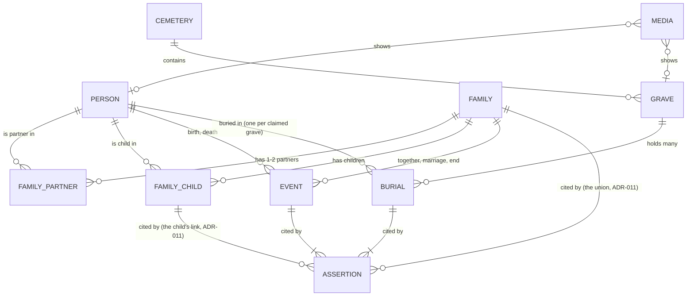

# Grobing — Data model

> **Żywy dom modelu danych.** Brief (`kickoff/PROJECT_BRIEF.md` §Architecture → *Data model*) jest
> zamrożonym zapisem decyzji z kick-offu; zmiany modelu trafiają **tutaj** (a zmiana schematu w kodzie —
> z migracją, [[NFR-003-migracje-schematu]]).
>
> Zbudowany z kanonu (brief, Step 0): rodzina jako rekord, wiele osób w grobie, zdarzenia z niepewną
> datą, nazwiska rodowe, **źródło przy faktach**. Pojęcia mapują się jeden do jednego na GEDCOM
> (individual, family, event, source + quality) — **bez importu i eksportu GEDCOM**, więc eksport (C2)
> zostaje tani.

## Entities

| Entity | Carries | Why this shape |
|---|---|---|
| **Person** | imiona · nazwisko · **nazwisko rodowe** · **płeć** (kobieta / mężczyzna, pusta = nieznana — `SEX` w GEDCOM 7; schemat v7, [[ADR-012-person-sex-and-union-timeline]]) · kim była (tekst) · `is_living` | nazwisko rodowe — [[FR-005-nazwisko-rodowe]]; `is_living` steruje prywatnością w eksporcie |
| **Family** | **związek** (małżeństwo albo nie): 1-2 partnerów · dzieci (**według daty urodzenia**, bez daty na końcu — GEDCOM 7 „chronological by birth”, [[ISSUE-019-family-relations]] D4) · **oś czasu związku**: własne zdarzenia „razem od”, ślubu i końca — ślub albo koniec, o których wiadomo, że były, bez daty to zdarzenie bez daty (`MARR Y` w GEDCOM 7; [[ADR-012-person-sex-and-union-timeline]]); twierdzenie o parze przy rodzinie, o dziecku przy jego łączu ([[ADR-011-relation-claims-family-and-child-link]]) | osoba może być partnerem w kilku rodzinach → powtórne małżeństwo działa z konstrukcji ([[FR-002-rodzina-jako-rekord]]) |
| **Event** | typ · **data + kwalifikator** (dokładnie / około / przed / po / między) · miejsce | „ok. 1890" i „przed 1920" to normalne dane ([[FR-004-data-z-dopiskiem]]). Typy: osoby — urodzenie, zgon, **pochówek** (`glossary.md` → *pochówek*: data pochówku to Event, nie cecha powiązania); rodziny — **razem od** (od v7; eksport jako `EVEN` + `TYPE`), małżeństwo, koniec. Data może być nieznana przy zdarzeniu, o którym wiadomo, że było (ślub, koniec — v7). Diagram z briefu wymienia tylko birth, death |
| **Cemetery** | nazwa · miejscowość · punkt środka · **plan** (obrys i alejki z OSM, pobrany przy dodaniu; brak = zaślepka) · link do Grobonetu albo **wyszukiwarki zarządcy** (decyzja autora przy US mapy cmentarza) | widok 1–2; plan i link — [[ADR-003-map-source-offline]] (2026-10-08). Ortofotomapa nie jest zapisywana (tylko online) |
| **Sector** (kwatera, *planowana* — EPIC-002) | nazwa („Kwatera 81”) · cmentarz · **strefa** zaznaczona przez autora (opcjonalna: kwatera może istnieć bez strefy, aż autor ją zaznaczy) | dane autora, nie zarządcy — [[ADR-003-map-source-offline]] pkt 3. Dziś kwatera to tylko tekst w `Grave.sector`; czy powstanie osobna encja, rozstrzyga US mapy cmentarza |
| **Grave** | **nazwa grobu** (`name`, opcjonalna, wpisuje autor — schemat v3, [[ISSUE-012-transcribe-grave-screen]]) · **kwatera / rząd / miejsce** (`sector` / `row` / `plot`) · pozycja + **jak ją uzyskano** (pinezka postawiona na planie albo na ortofotomapie / GPS na miejscu — [[ADR-003-map-source-offline]]) + dokładność · zdjęcia nagrobka · opłata ważna do (S4) | adres zarządcy jest prawdą, pinezka pomocą |
| **Burial** | grób ↔ osoba, wiele na grób; osoba ma osobny wiersz dla każdego grobu, który podaje dla niej jakieś źródło | grób rodzinny mieści kilka osób ([[FR-003-wiele-osob-w-grobie]]); człowiek leży w jednym miejscu, ale źródła mogą się różnić ([[ADR-006-claimed-value-separate-structures]] D2) |
| **Assertion** (provenance) | **źródło** (nagrobek / notatki / babcia / krewny / akt) + szczegół (kto, który akt) · **status** `CLAIMED / CONFIRMED / CONTRADICTED / UNKNOWN` · kiedy — **przy wierszu *Event* albo *Burial***, którego wartość potwierdza, **albo przy rodzinie i łączu dziecka** (relacje, schemat v6 — [[ADR-011-relation-claims-family-and-child-link]]); wartość („co twierdzimy”) żyje w tym wierszu | cytowanie źródła jak w GEDCOM 7; **dwa sprzeczne twierdzenia współistnieją** jako dwa wiersze, każdy ze swoim twierdzeniem ([[FR-001-provenance]], [[ADR-006-claimed-value-separate-structures]]) **Od 2026-10-08 uśpione:** aplikacja nie pokazuje i nie zbiera źródła ani statusu ([[SPIKE-004-mvp-flow-prototype]] D28); kolumny zostają, formularz wpisuje domyślne źródło. |
| **Media** | **zdjęcie jako rekord** (jak `MULTIMEDIA_RECORD` w GEDCOM 7): plik w prywatnym magazynie aplikacji i, dla nagrobka, grób. **Zdjęcie = kopia dostępowa:** JPEG 2048 px, bez EXIF ([[ADR-008-photos-access-copy-and-backup-consistency]]); pliki `media/groby/<id>/<czas>-<losowe>.jpg` i `media/zdjecia/<czas>-<losowe>.jpg` (zdjęcia osób, bez id osoby — bywają wspólne). **Grób — najwyżej jedno zdjęcie** (pierwsze = najniższe `id`). Usunięcie kasuje wiersz, plik usuwa sprzątanie (ADR-008 pkt 3). Wiersz bez grobu i bez łącza znika w tej samej transakcji ([[ADR-009-person-photos-record-and-link]]) | oryginał zostaje w galerii albo na papierze |
| **PersonMedia** (łącze zdjęcia) | osoba ↔ zdjęcie z **pozycją** (jak `OBJE` w GEDCOM 7) — schemat v4, [[ISSUE-017-person-photos]]. **Profilowe = pierwsze łącze osoby**, osobno dla każdej osoby; jedno zdjęcie (np. grupowe) ma łącza od wielu osób, a plik jest jeden. Zmiany zdjęć osoby zapisują się w transakcji jej wpisu ([[ADR-009-person-photos-record-and-link]]) | kto jest na zdjęciu — bez źródła ([[FR-001-provenance]]: daty, relacje, pochówek; łącze w GEDCOM 7 nie ma `SOUR`). **Kadr profilowego** (schemat v5): `CROP` przy łączu — cztery kolumny `crop_*` w pikselach pliku zdjęcia; brak = środek; każda osoba na zdjęciu ma własny ([[ADR-010-profile-photo-crop-pixels]]) |
| **Setting: „ja"** | która osoba to autor | kotwica „jak łączą się ze mną" (M5). W kodzie: tabela `settings` od v1, jeden wiersz `id = 1`, zapisywany przy pierwszym wyborze w ustawieniach albo w zakładce Osoby ([[ISSUE-022-app-skeleton-tabs-people-settings]]); jedzie w kopii razem z bazą |

## Rules that are not tables

- **Ścieżka między dwiema osobami** = najkrótsza droga po krawędziach osoba–rodzina (partner, dziecko),
  pokazywana jako łańcuch („ja → żona → jej ojciec → …"). **Liczona, nigdy zapisywana.**
- **Ziarnistość źródeł (decyzja kosztowa z kick-offu):** twierdzenia na **datach, relacjach i miejscu
  pochówku** — to, o co się spiera; „kim była" niesie jedną linię źródła. Źródło na każdym polu
  spowolniłoby przepisywanie ~100 osób (G6).
- **Gdzie żyje:** lokalny SQLite + zdjęcia w prywatnym magazynie aplikacji ([[ADR-001-local-first]]);
  kopia i eksport — [[ADR-004-backup-format-encryption-destination]].

## In code

- **2026-10-05 — schemat v1** ([[ISSUE-007-data-layer]], [[ADR-005-sqlite-package]]):
  `grobing-code/lib/data/database.dart`. Są w nim wszystkie encje z tabeli wyżej **oprócz *Assertion***,
  a także bez opłaty za grób (S4, poza Must) i statusu mapy offline cmentarza ([[SPIKE-001-map-source-offline]]).
  Powód: model nie mówi, gdzie żyje wartość spornej daty, w *Event* czy w *Assertion*. *Assertion*
  przyjdzie jako v2 przy [[US-002-przepisanie-grobu]], z pierwszym prawdziwym testem migracji. Ta tabela
  się nie zmienia; to stan wdrożenia, nie korekta modelu.
- **2026-10-06 — schemat v2** ([[ISSUE-011-schema-v2-assertions]]). Odpowiedź na pytanie z v1: **wartość
  żyje w *Event* (data z dopiskiem) i w *Burial* (grób), a *Assertion* jest cytowaniem przy wierszu**, jak
  w GEDCOM 7. Sprzeczna wartość to osobny wiersz, a pokazuje się pierwszy
  ([[ADR-006-claimed-value-separate-structures]]). Tabela `assertions`; `burials` z `id`, bez UNIQUE na
  osobie, z UNIQUE (osoba, grób). Zapis faktów przez `grobing-code/lib/data/claims.dart`. Wiersze z v1
  dostały twierdzenie „notatki, przeniesione z v1”. Diagram i wiersze *Burial* / *Assertion* wyżej
  poprawione według ADR-006, więc to **korekta modelu**, nie tylko stan wdrożenia. Twierdzenia przy
  relacjach (diagram: „US-003”) jeszcze nie są w kodzie.
- **2026-10-06 — punkt cmentarza ma pisarza** ([[ISSUE-014-home-map-of-poland]]): `center_lat` / `center_lon`
  (od v1) zapisuje i poprawia ekran główny przez `grobing-code/lib/data/cemeteries.dart`; cmentarz bez punktu
  nie ma znicza na mapie. Bez zmiany schematu. Cmentarz to miejsce, a nie fakt o osobie, więc nie ma
  twierdzeń ([[FR-001-provenance]]).
- **2026-10-08 — schemat v6** ([[ISSUE-019-family-relations]], [[ADR-011-relation-claims-family-and-child-link]]): twierdzenia przy
  relacjach są w kodzie — `assertions.family_id` (para) i `assertions.family_child_id` (łącze dziecka, które dostało `id`);
  `CHECK`: twierdzenie cytuje dokładnie jeden wiersz. Zapis i usuwanie rodziny przez `grobing-code/lib/data/families.dart`
  (`saveFamily`, `deleteFamily`), w jednej transakcji, z regułami arkusza (1–2 osoby w parze, co najmniej dwie osoby,
  nikt dwa razy, dziecko w jednej rodzinie rodziców). Migracja v5→v6 nie dodała wierszy (rodziny sprzed v6 — tylko z
  danych debug — dostają twierdzenie przy pierwszym zapisie). **Płci w modelu nie ma** (decyzja autora; do v7); nazwy relacji
  na ekranie są neutralne.
- **2026-10-08 — schemat v7** ([[ISSUE-025-gender-kinship-together-since]], [[ADR-012-person-sex-and-union-timeline]]):
  `persons.sex` (`female` / `male`, pusta = nieznana; podpowiedź z imienia tylko na ekranie) i nowy typ zdarzenia rodziny
  `together` („Razem od”). Ślub i koniec bez daty to zdarzenia bez daty; `families.dart` → `saveFamily` dostaje `together`,
  `married`, `ended`. Migracja v6→v7 tylko dodaje kolumnę — kopie v6 odtwarzają się bez zmian w kodzie odtworzenia.
  Związki osoby według pierwszej daty związku (razem od, a bez niej ślub).

## Known consequence — not a model change

**Korekta autora (2026-10-05): notatki nie zawierają adresów kwater.** Grób przepisany z notatek ma
więc cmentarz i osoby, ale **ani adresu kwatery, ani pozycji** — oba powstają dopiero na miejscu (krok 6
UJ-001). Pola modelu zostają; nie mogą być wymagane przy wprowadzaniu. Jak taki grób znaleźć przy
pierwszej wizycie — ⚠️ **OPEN**, decyzja autora: `00_START_HERE/TRACEABILITY.md` → *Open gaps* 1.

**Decyzja autora (2026-10-06):** jeden wpis w notatkach = jeden nagrobek i osoby w nim, więc **Burial →
Grave zostaje wymagane** — model bez zmian. Gdyby przy przepisywaniu pojawił się wpis bez grobu, wraca
opcja „pochówek = osoba + cmentarz, grób opcjonalny” ([[US-002-przepisanie-grobu]] → *Open questions*).
