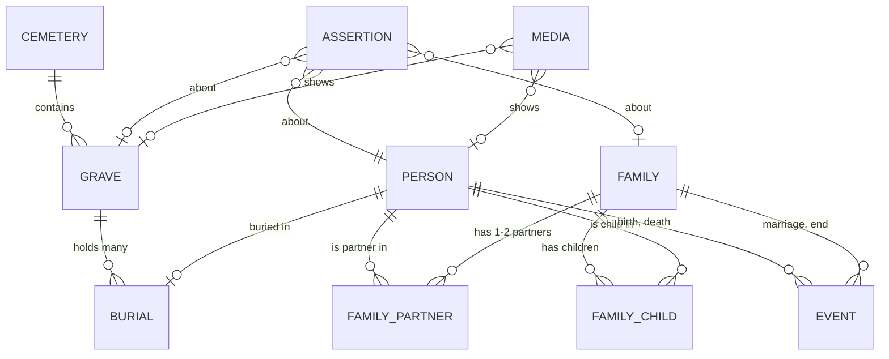

# Grobing — Data model

> **Żywy dom modelu danych.** Brief (`kickoff/PROJECT_BRIEF.md` §Architecture → *Data model*) jest
> zamrożonym zapisem decyzji z kick-offu; zmiany modelu trafiają **tutaj** (a zmiana schematu w kodzie —
> z migracją, [[NFR-003-migracje-schematu]]).
>
> Zbudowany z kanonu (brief, Step 0): rodzina jako rekord, wiele osób w grobie, zdarzenia z niepewną
> datą, nazwiska rodowe, **źródło przy faktach**. Pojęcia mapują się jeden do jednego na GEDCOM
> (individual, family, event, source + quality) — **bez importu i eksportu GEDCOM**, więc eksport (C2)
> zostaje tani.

## Entities

| Entity | Carries | Why this shape |
|---|---|---|
| **Person** | imiona · nazwisko · **nazwisko rodowe** · kim była (tekst) · `is_living` | nazwisko rodowe — [[FR-005-nazwisko-rodowe]]; `is_living` steruje prywatnością w eksporcie |
| **Family** | 1-2 partnerów · dzieci · własne zdarzenia małżeństwa / końca | osoba może być partnerem w kilku rodzinach → powtórne małżeństwo działa z konstrukcji ([[FR-002-rodzina-jako-rekord]]) |
| **Event** | typ · **data + kwalifikator** (dokładnie / około / przed / po / między) · miejsce | „ok. 1890" i „przed 1920" to normalne dane ([[FR-004-data-z-dopiskiem]]). Typy: osoby — urodzenie, zgon, **pochówek** (`glossary.md` → *pochówek*: data pochówku to Event, nie cecha powiązania); rodziny — małżeństwo, koniec. Diagram z briefu wymienia tylko birth, death |
| **Cemetery** | nazwa · miejscowość · punkt środka · link do Grobonetu (jeśli pokryty) · status mapy offline | widok 1; dwa ostatnie pola wypełnia SPIKE-001 / [[ADR-003-map-source-offline]] |
| **Grave** | **kwatera / rząd / miejsce** (`sector` / `row` / `plot`) · pozycja + **jak ją uzyskano** (pinezka ze zdjęcia satelitarnego / GPS na miejscu) + dokładność · zdjęcia nagrobka · opłata ważna do (S4) | adres zarządcy jest prawdą, pinezka pomocą |
| **Burial** | grób ↔ osoba, wiele na grób | grób rodzinny mieści kilka osób ([[FR-003-wiele-osob-w-grobie]]) |
| **Assertion** (provenance) | co twierdzimy · **źródło** (nagrobek / notatki / babcia / krewny / akt) · **status** `CLAIMED / CONFIRMED / CONTRADICTED / UNKNOWN` · kiedy · kto | „wniosek z dowodów" z kanonu + wzorzec WZ-036; **dwa sprzeczne twierdzenia współistnieją** ([[FR-001-provenance]]) |
| **Media** | pliki zdjęć w prywatnym magazynie aplikacji, powiązane z osobą albo grobem | — |
| **Setting: „ja"** | która osoba to autor | kotwica „jak łączą się ze mną" (M5) |

## Rules that are not tables

- **Ścieżka między dwiema osobami** = najkrótsza droga po krawędziach osoba–rodzina (partner, dziecko),
  pokazywana jako łańcuch („ja → żona → jej ojciec → …"). **Liczona, nigdy zapisywana.**
- **Ziarnistość źródeł (decyzja kosztowa z kick-offu):** twierdzenia na **datach, relacjach i miejscu
  pochówku** — to, o co się spiera; „kim była" niesie jedną linię źródła. Źródło na każdym polu
  spowolniłoby przepisywanie ~100 osób (G6).
- **Gdzie żyje:** lokalny SQLite + zdjęcia w prywatnym magazynie aplikacji ([[ADR-001-local-first]]);
  kopia i eksport — [[ADR-004-backup-format-encryption-destination]].

## In code

- **2026-10-05 — schemat v1** ([[ISSUE-007-data-layer]], [[ADR-005-sqlite-package]]):
  `grobing-code/lib/data/database.dart`. Są w nim wszystkie encje z tabeli wyżej **oprócz *Assertion***,
  a także bez opłaty za grób (S4, poza Must) i statusu mapy offline cmentarza ([[SPIKE-001-map-source-offline]]).
  Powód: model nie mówi, gdzie żyje wartość spornej daty, w *Event* czy w *Assertion*. *Assertion*
  przyjdzie jako v2 przy [[US-002-przepisanie-grobu]], z pierwszym prawdziwym testem migracji. Ta tabela
  się nie zmienia; to stan wdrożenia, nie korekta modelu.

## Known consequence — not a model change

**Korekta autora (2026-10-05): notatki nie zawierają adresów kwater.** Grób przepisany z notatek ma
więc cmentarz i osoby, ale **ani adresu kwatery, ani pozycji** — oba powstają dopiero na miejscu (krok 6
UJ-001). Pola modelu zostają; nie mogą być wymagane przy wprowadzaniu. Jak taki grób znaleźć przy
pierwszej wizycie — ⚠️ **OPEN**, decyzja autora: `00_START_HERE/TRACEABILITY.md` → *Open gaps* 1.
